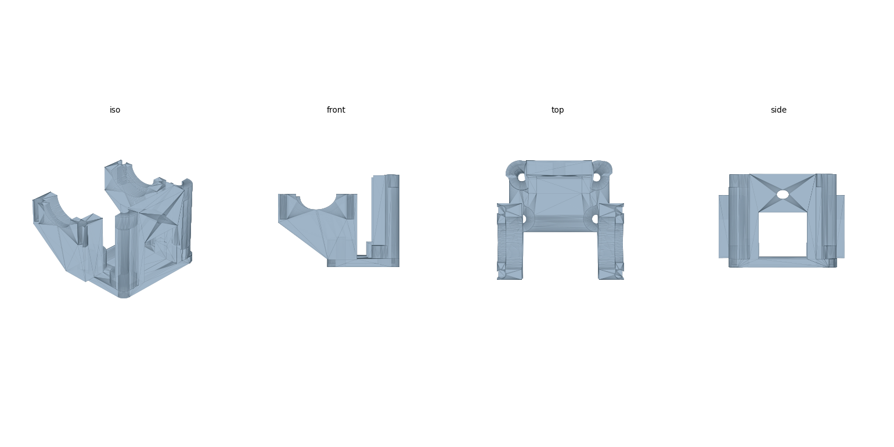
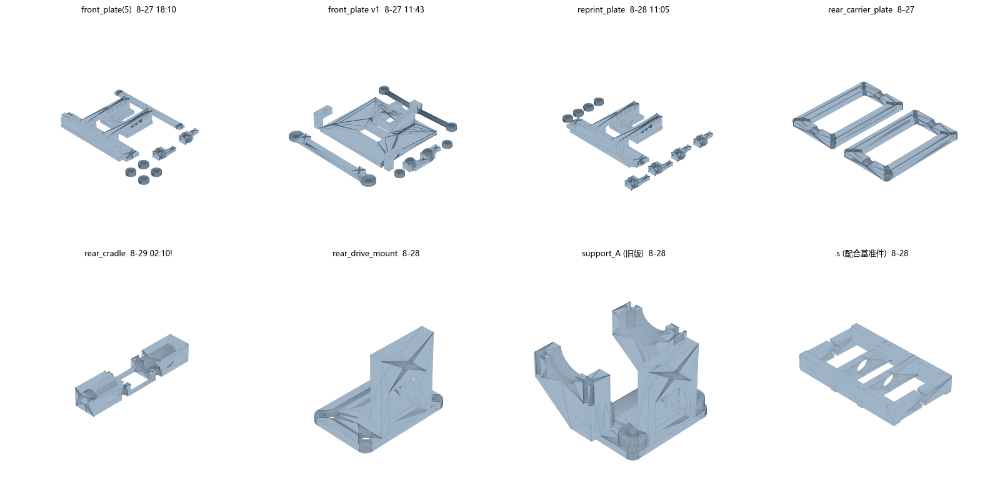

# hackathon-racecar 🏆

北邮 & 中大四天三夜赛车黑客松（2026-08-26 ~ 08-29）**冠军车**的机械设计资料。

3D 打印底盘 + STM32 电控 + FPV 第一视角驾驶的迷你竞速车。四天内完成建模 → 打印 →
装配 → 调试 → 比赛全流程，最终在决赛夺冠（车手即本仓库作者）。

*Championship-winning mini FPV race car from a 4-day hackathon — mechanical design
files, printable STLs, gear-train calculators and build documentation. (Docs in Chinese.)*



## 仓库内容

| 目录 | 内容 |
|---|---|
| `stl/` | 全套可打印 STL：前桥、后桥、轮辐盘（见下方零件清单） |
| `docs/机械结构说明书.pdf` | 差速器 / 传动 / 悬挂三大系统的原理与装配说明（含矢量示意图） |
| `docs/team/` | 团队文档模板：分工表、每日调试日志、赛道测试与调参记录、道具赛机制设计、差速器装配流程 |
| `tools/` | 齿轮传动计算器（Python）与说明书 PDF 生成脚本 |

## 零件清单



| 文件 | 说明 |
|---|---|
| `front_plate_final_0828.stl` | **前桥打印板（最终定稿版）**：主框架 + 转向节 + 轮毂盘，刚性结构 + 顶丝锁 + 销槽转向 |
| `rear_axle_mount_redesign.stl` | **后轴承座（重设计版）**：半圆轴承窝 + 侧导轨 |
| `rear_axle_carrier_print_plate.stl` | 后桥载架打印板（两个框架） |
| `rear_drive_mount.stl` | 后驱动电机支架 |
| `rear_axle_cradle_racefix.stl` | 后轴托架 —— 比赛日凌晨 2:10 的抢修件，赛场应急设计的纪念 |
| `mate_interface_reference.stl` | 后桥配合接口基准件：新零件的四工位轴线必须与它对齐 |
| `wheel_plate_x4.stl` | 轮辐盘 ×4 打印板 |
| `iterations/` | 被最终版取代的历史迭代（前桥 v1/v5、后轴承座旧版），保留供参考设计演进 |

打印参数：PLA，所有孔按名义尺寸 +0.25 mm 补偿设计（宁松勿紧，松了用顶丝锁）。

## 关键设计参数

| 项目 | 数值 |
|---|---|
| 齿轮模数 | 0.5 |
| 传动方案 | 单级减速，电机 8T 小齿 → 差速器 29T 盘齿 |
| 传动比 | 3.625（中心距 9.25 mm） |
| 车轮直径 | 28.14 mm |
| 理论极速 | ≈ 5.3 m/s (19 km/h) |
| 电机 | 有刷 13000 rpm / 28 g·cm / 7.0 V |
| 打印孔径补偿 | 名义尺寸 +0.25 mm（PLA，宁松勿紧，松了用顶丝锁） |

## 齿轮计算器用法

```bash
# 双联齿轮多级传动链：极速 / 加速度 / 每级中心距 / 编码器换算
python tools/gear_train.py --pinion 8 10 --compound 30:9 --final 29 --wheel 28.14

# 独立齿轮两两啮合的单级/两级方案枚举
python tools/gear_calc.py --tip-dia 15 16 9 17 --wheel 28.14
```

计算器会按「分度圆 d = m·z、中心距 a = m(z₁+z₂)/2」把齿数配对换算成整车极速、
起步加速度和建模打孔用的中心距，并给出室内小赛道的可用性判断。

## 经验教训（写给下一届）

- **打印队列是全营最大的瓶颈**——Day1 晚上必须交出切片，建模宁可保守也别返工
- **卡尺量到的是齿顶圆不是分度圆**，差 2 个齿 = 0.5 mm 中心距误差，足以卡死；数齿数核对
- **所有孔画名义 +0.25 mm**，锚点选前后轮毂；松了可以顶丝锁，紧了只能重打
- **耐力赛强制换胎** → 快拆车轮机构在 Day1 建模时就要设计进去
- 红外计时传感器和图传天线必须装车顶朝正上方，被车壳挡住就计不了圈

## 说明

- 车端固件基于主办方提供的 GT_Car 模板（STM32F103RCT6 + FreeRTOS）开发，
  模板版权归主办方，故固件代码不在本仓库内；本仓库仅包含我们自己的设计产出。
- SolidWorks 源文件由队友持有，本仓库提供打印用 STL。

## License

[MIT](LICENSE) — 随意使用、修改、商用，保留署名即可。
